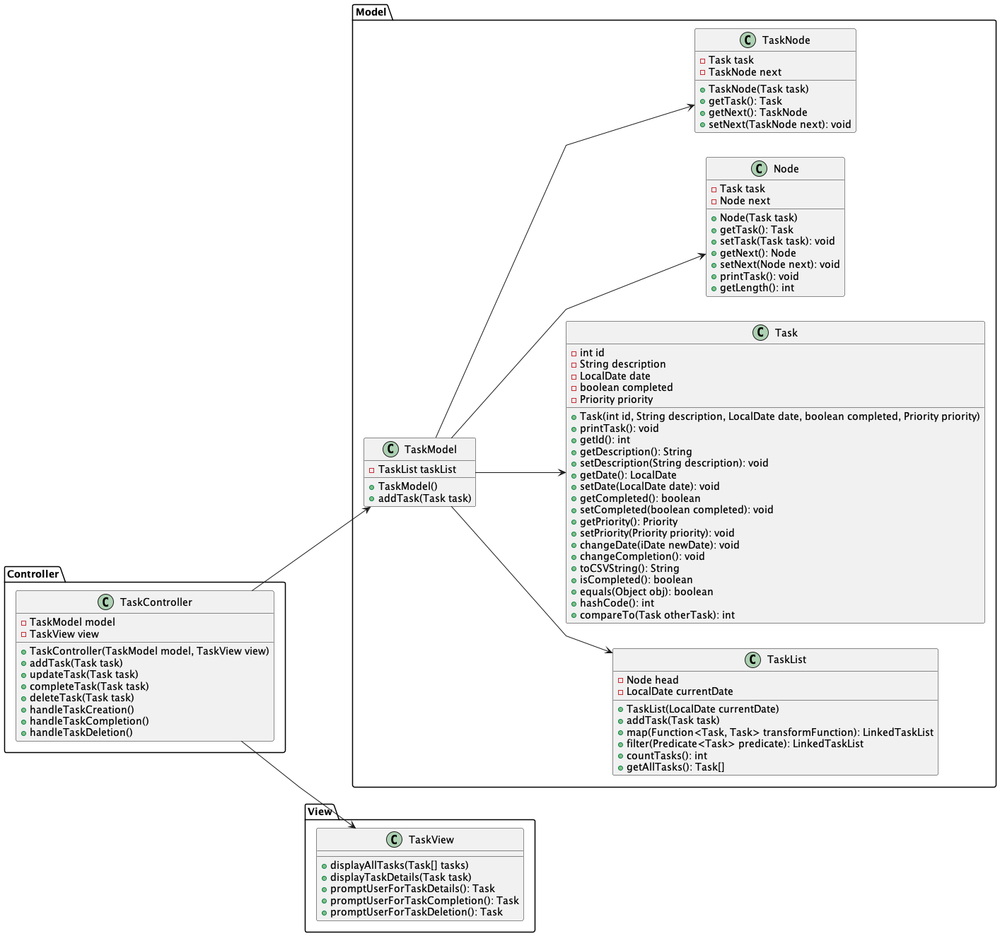

# CS5004-Final | Natalie Grillo | TaskList App

---
## Introduction:
For my CS5004 Final Assignment, I developed the TaskList App, focusing on creating a comprehensive task management application. The project is organized around the main Task Management System, with smaller applications demonstrating various programming concepts.

### Main Application: TaskList App

*   The TaskList App serves as the "main" application, providing users with features to create, edit, delete, and organize tasks efficiently.
*   It implements the Model-View-Controller (MVC) design pattern to keep a clear modular, maintainable, and scalable program.
*   The `TaskModel` represents task data and business logic.
*   The `TaskView` handles task presentation to the user interface.
*   The `TaskController` acts as an "middle man", facilitating interactions between the model and view.

### Smaller Applications for Other Concepts:

*   Adding Tasks.
*   Editing Task.
*   Filtering tasks by date, completion, priority.
*   Removing Tasks.
*   Saving to a CSV file.
*   Loading from a CSV file.

### Additional Information:
*	Throughout the project, I prioritized code organization, readability, and extensibility.
*	The application's design is focused on maintenance and future enhancements by encapsulating implementation details and promoting code reusability.

### UML Diagram:

---

## Concept Map:

| **Concept 1: Recursion in Practice** | **File** | **Lines** | **Description** |
|--------------------------------------|----------|-----------|-----------------|
| Recursion                            | TaskList.java | 117-129 | The `removeTask` method uses recursion to traverse the linked list and add a new task to the end. |
|                                      | TaskList.java | 201-216 | The `removeTask` method is a recursive helper method to remove a task from the linked list. |
|                                      | TaskList.java | 231-246 | The `getTaskByIdRecursive` method is a recursive helper method to retrieve a task by its ID from the linked list. |
| Extension Concept 1                  |          |           | The majority of my program uses iteration instead of recursion to execute the blocks of code until the condition is met. However, I included a couple of recursive methods in the `TaskList` class to demonstrate understanding of the concept. |
---
| **Concept 2: Logical Structure and Design using Abstract Classes and Interfaces**  | **File** | **Lines** | **Description** |
|--------------------------------------|----------|-----------|-----------------|
| Abstract Classes and Interfaces                                                  | EventController.java        | 1-31      | The `EventController` class implements the `ITaskController` interface, providing a common structure for task controllers. |
|                                                                                   | NonEventController.java     | 1-31      | The `NonEventController` class also implements the `ITaskController` interface, following the same structure as `EventController`. |
|                                                                                   | ITaskController.java        | 1-12      | The `ITaskController` interface defines methods for task controllers to implement, ensuring a consistent interface across different controller implementations. |
|                                                                                   | ITask.java                  | 1-13      | The `ITask` interface defines common behavior for tasks, allowing different types of tasks to be treated uniformly.          |
|                                                                                   | TaskListADT.java            | 1-7       | The `TaskListADT` interface defines methods for interacting with a task list, providing a standardized interface for different implementations of task lists. |
| Abstract Data Types (ADTs)                                                       | TaskList.java               | 1-7       | The `TaskList` class implements the `TaskListADT` interface, representing a task list abstract data type with defined operations. |
| Extension Concept 2                                                                |                             |           | I have consistently utilized abstract classes and interfaces throughout the application's design, ensuring modularity and maintainability. These abstractions facilitate a logical structure and promote code reusability across different components. |
---
| **Concept 3: Generics and Lambda Expressions**  | **File** | **Lines** | **Description** |
|--------------------------------------|----------|-----------|-----------------|
| Generics and Lambda Expressions                                                    | NonEventController.java     | 78-96     | The `NonEventController` class utilizes lambda expressions in methods such as `getTasksByCompletion`, `getTasksByPriority`, and `getTasksByDate` to filter tasks based on completion status, priority, and date, respectively. Lambda expressions offer concise implementations of functional interfaces, enhancing code readability and flexibility. |
|                                                                                    | EventController.java        | 1-39      | The `EventController` class implements the `ITaskController` interface, providing a common structure for task controllers. Lambda expressions are used in methods such as `getTasksByCompletion`, `getTasksByPriority`, and `getTasksByDate` to filter tasks based on completion status, priority, and date, respectively. Lambda expressions provide concise implementations of functional interfaces, enhancing readability and flexibility. |
| Extension Concept 3                                                                |                             |           | The `EventController` class demonstrates the utilization of lambda expressions and Java streams to implement higher-order functions for filtering tasks. Lambda expressions provide concise implementations of functional interfaces, enhancing readability and flexibility in the code. |
---
| **Concept 4: Higher Order Functions Map, Filter, and Fold** | File             | Lines   | Description                                                                                                                                                         |
|------------------------------------------------------------|------------------|---------|---------------------------------------------------------------------------------------------------------------------------------------------------------------------|
| Higher Order Functions                                      | EventController.java | 64-89 | The `EventController` class uses Java streams and lambda expressions to implement the `filter` higher-order function. It filters tasks based on completion status, priority, and date criteria. |
|                                      | ITaskController.java | 46-77 | The `ITaskController` interface defines methods that can be implemented using higher-order functions like `filter`. These methods enable retrieving tasks based on various criteria such as completion status, priority, and date. |
|                                                    | EventController | 45-59 | Java Streams are used in methods like `getTasksByCompletion`, `getTasksByPriority`, and `getTasksByDate` to filter tasks based on various criteria using lambda expressions. |
| Extension Concept 4                                                                |                             |           | The `ITaskController` interface serves as a blueprint for implementing classes that can utilize higher-order functions through Java streams and lambda expressions for filtering tasks based on different criteria.      | 
---
| **Concept 5: Hierarchical Data Representation as an ADT or a Linked List ADT** | **File**      | **Lines**    | **Description**                                                                                   |
|-------------------------------------------------------------------------------|---------------|--------------|---------------------------------------------------------------------------------------------------|
| Linked List ADT Implementation                                                   | TaskList.java | 1-126        | The `TaskList` class implements a linked list ADT to represent and manage a list of tasks.        |
| Encapsulation of Behavior and Properties                                          | TaskList.java | 1-126        | The `TaskList` class encapsulates the behavior and properties of a task list, providing a high-level abstraction that allows users to interact with tasks without needing to know the underlying implementation details. |
| Clear Interface Definition                                                        | TaskListADT.java | 1-7      | The `TaskListADT` interface defines a standardized set of methods (addTask, removeTask, getTaskById) that any implementation of a task list should adhere to, promoting consistency and interoperability. |
| Flexibility and Maintenance                                                       | TaskList.java | 1-126        | The `TaskList` class allows for easy maintenance and future enhancements to the program by encapsulating the implementation details of managing tasks and providing a clear interface for users to interact with tasks. |
| Hierarchical Data Representation                                                  | TaskList.java | 1-126        | The hierarchical data representation utilized by the `TaskList` class organizes tasks sequentially, with each task linked to the next one in the list. This structure enables efficient manipulation of tasks, such as adding, removing, and traversing through the list. |
---
| **Concept 6: Architectures and Design Patterns (MVC Design and a Design Pattern)** | **File** | **Lines** | **Description** |
| --- | --- | --- | --- |
| MVC Design Pattern Implementation | EventController.java | 1-96 | The `EventController` class implements the Model-View-Controller (MVC) design pattern, separating the application logic (controller) from the user interface (view) and the data (model). This promotes modularity, maintainability, and scalability of the application. |
| MVC Design Pattern Implementation | TaskModel.java | 1-78 | The `TaskModel` class represents the model component in the MVC architecture for task management. It provides methods to interact with tasks, such as adding, retrieving, and modifying tasks. |
|  | TaskView.java | 1-20 | The `TaskView` class represents the view component in the MVC architecture for task management. It provides methods to display tasks to the user interface. |
|  | TaskController.java | 1-123 | The `TaskController` class represents the controller in the MVC architecture for managing tasks. It orchestrates interactions between the model and view, handling tasks such as adding, removing, editing, and displaying tasks. |
| Extension Concept 6 |  |  | I demonstrated this concept by implementing the MVC pattern in the task management system, where the `TaskModel` serves as the model, the `TaskView` handles the view, and the `TaskController` acts as the controller. This separation of concerns allows for better organization, maintainability, and scalability of the codebase. |

| **Concept 7: SOLID Design Principles**                                              | **File**         | **Lines**    | **Description**                                                                                   |
|-------------------------------------------------------------------------------------|------------------|--------------|---------------------------------------------------------------------------------------------------|
| Single Responsibility Principle (SRP) Implementation                                 | EventController.java | 1-96    | The `EventController` class adheres to the Single Responsibility Principle by focusing on a single aspect of the application logic: managing tasks. It handles task-related operations such as adding, removing, updating, and retrieving tasks, ensuring that each class or module has only one reason to change. |
|                                                                                     | TaskList.java | 1-126 | The `TaskList` class also follows the Single Responsibility Principle by encapsulating the logic for managing a list of tasks. It is responsible for operations such as adding, removing, and retrieving tasks from the list, maintaining a clear and focused purpose. |
| Single Responsibility Principle (SRP) |          |           | Each class has a clear responsibility. For example, `TaskListGUI` is responsible for managing the user interface, `TaskModel` handles the task-related data, and controllers (`TaskController`, `EventController`, `NonEventController`) manage interactions between the view and the model. |
| Open/Closed Principle (OCP)            |          |           | My code is open for extension but closed for modification. New functionality can be added by extending existing classes or implementing new interfaces without modifying existing code. |
| Liskov Substitution Principle (LSP)    |          |           | Subtypes (such as different types of controllers) can be substituted for their base types (e.g., `ITaskController`) without affecting the program. |
| Interface Segregation Principle (ISP)  |          |           | Interfaces for example `ITaskController`, `ITask  are focused on specific responsibilities, ensuring that implementing classes only need to be concerned with methods relevant to their purpose. |
| Dependency Inversion Principle (DIP)   |          |           |`TaskListGUI` depends on abstractions (`ITaskController`, `ITask`), not on concrete implementations (`TaskController`, `Task`), this allows for decoupling and flexibility. |

## Academic Integrity Statment:

Computer science, both academically and professionally, is a collaborative discipline. In any collaboration, however, all parties are expected to make their own contributions and to generously credit the contributions of others. In our class, therefore, collaboration on homework and programming assignments is encouraged, but you as an individual are responsible for understanding all the material in the assignment and doing your own work. Always strive to do your best, give generous credit to others, start early, and seek help early from both your professors and classmates.
The following rules are intended to help you get the most out of your education and to clarify the line between honest and dishonest work. The professor reserves the right to ask you to verbally explain the reasoning behind any answer or code that you turn in and to modify your project grade based on your answers. It is vitally important that you turn in work that is your own. Follow the guidelines for academic honesty or we're done.
If you have had a substantive discussion of any homework or programming solution with a classmate, then be sure to cite them in your report. If you are unsure of what constitutes "substantive", then ask us or err on the side of caution. You will not be penalized for working together. You must not copy answers or code from another student either by hand or electronically. Another way to think about it is that you should be talking English with one another, not Python.
The following rules apply to anything you hand in for a grade.
- You may not copy anyone else's code under any circumstances. This includes online sources.
- You may not permit any other student to see any part of your code.
- You may not permit yourself to see any part of another student's code.
- You may not post a public question to any discussion board that contains any part of your code.
- You may consult online resources as part of your coursework, but you may not copy code from online sources. If you get an idea of how to solve a problem from an online source, include a short citation in a code block at the top of your file.
The university's academic integrity policy discusses actions regarded as violations and consequences for students: Office of Student Conduct and Conflict Resolution - Academic Integrity Policy

<u>All work is my own Natalie Grillo (4/15/2024)</u>

## Code Files:
*  Github Account name: NxxGxx
*  Link to Assignment on Github:

## Video Walkthrough:

## Resources:
[1] "Steam" JavaDocs [Online]. Available: [Stream](https://docs.oracle.com/javase/8/docs/api/java/util/stream/Stream.html)

[2] "Confetti" Youtube [Online]. Available: [Confetti](https://www.youtube.com/watch?v=GiA6ls9mOL4)

[3] "Generics" JavaDocs [Online]. Available: [Generics](https://docs.oracle.com/javase/tutorial/extra/generics/methods.html)

[4] "Nested Classes" JavaDocs [Online]. Available: [NestestClasses](https://docs.oracle.com/javase/tutorial/java/javaOO/nested.html)

